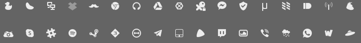
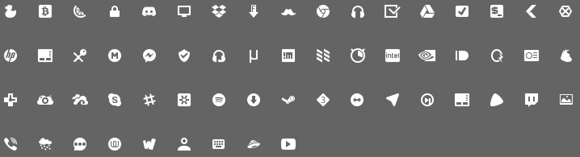

[](https://travis-ci.org/bil-elmoussaoui/Hardcode-Tray) [](https://www.codacy.com/app/bil-elmoussaoui/Hardcode-Tray?utm_source=github.com&amp;utm_medium=referral&amp;utm_content=bil-elmoussaoui/Hardcode-Tray&amp;utm_campaign=Badge_Grade)
[](https://www.codacy.com/app/bil-elmoussaoui/Hardcode-Tray?utm_source=github.com&amp;utm_medium=referral&amp;utm_content=bil-elmoussaoui/Hardcode-Tray&amp;utm_campaign=Badge_Coverage)
[](https://gitter.im/Hardcode-Tray/Lobby?utm_source=share-link&utm_medium=link&utm_campaign=share-link)
[](https://github.com/bil-elmoussaoui/Hardcode-Tray/releases)

# Hardcode-Tray

Fixes Hardcoded tray icons in Linux

The script will automatically detect your default theme, the correct icon size, the hard-coded applications, the correct icons for each indicator and fix them. All that with the possibility to revert to the original icons.

## Themes
Here's a list of themes that supports Hardcode-Tray:
  - [Numix icon theme](https://github.com/numixproject/numix-icon-theme)

 <div align="center"></div>

  - [Papirus icon theme](https://github.com/PapirusDevelopmentTeam/papirus-icon-theme)

 <div align="center"></div>

## Install

#### Arch Linux (AUR):
Stable version:
```bash
yaourt -S hardcode-tray sni-qt-patched-git lib32-sni-qt-patched-git
```
<small>The sni-qt patched library by Hardcode-Tray team is still on beta, we will replace the git version with a stable release once we release one.</small>
Developpement version:
```bash
yaourt -S hardcode-tray-git sni-qt-patched-git lib32-sni-qt-patched-git
```
#### Ubuntu 14.04 / 16.04 / 16.10 / 17.04 (PPA):
```bash
sudo add-apt-repository ppa:andreas-angerer89/sni-qt-patched
sudo apt update
sudo apt install sni-qt sni-qt:i386 hardcode-tray
```

#### OpenSUSE (Leap 42.2 / Tumbleweed):
OpenSUSE package only contains the patched version of sni-qt. In order to get Hardcode-Tray, please follow the manual installation method.

The one click-installer can be found by following this [link](https://software.opensuse.org/package/sni-qt-patched)

#### Manual installation:
  1. Download and install the script:
  ```bash
  cd /tmp && wget -O - https://raw.githubusercontent.com/bil-elmoussaoui/Hardcode-Tray/master/data/install.sh | bash
  ```

  2. Install dependencies:
   - `git`
   - `wget`
   - `python3`
   - `python3-gi`
   - [`patched sni-qt`](https://github.com/bil-elmoussaoui/sni-qt) <br>
   - 2.1. Pick up your favorite conversion tool
       1. `python3-cairosvg`
       2. `librsvg`
       3. `inkscape`
       4. `imagemagick`
       5. `svgexport`
  3. Open Hardcode-Tray using this command
    <pre>hardcode-tray</pre>

  4. Enjoy!

You can build [the patched version of sni-qt](https://github.com/bil-elmoussaoui/Hardcode-Tray/wiki/How-to-build-Sni-qt) from source code if you are using a different distribution (like Fedora).<br />
The `sni-qt:i386` is used for 32 bits applications as Skype.<br />
Teamviewer is also using the `sni-qt` package. However, it is shipping its own version. Therefore this script also overwrites the version shipped by TeamViewer with the patched one.

## Options
- `--apply` and `--revert`

Hardcode-Tray shows a welcome message by default and asks the user to choose between applying the fix or reverting it. You can hide that using
```bash
hardcode-tray --apply
```
or

```bash
hardcode-tray --revert
```

- `--only`

You can use the `--only` argument to fix/revert only one application; don't use the argument if you want to fix all applications your icon theme supports.
```bash
hardcode-tray --only telegram, skype
```

In order to get the names needed to fix only specific programs, you can look at the `app_name` key in the JSON files for the program. There you can find the corresponding name for the program you want to fix.

- `--path`

If you installed your app in a non-standard location, you can override the path where the icons are stored using the `--path` argument. Only works in combination with the `--only` argument for a single application.
```bash
hardcode-tray --only telegram --path /home/user/telegram/
```

- `--size`

You can also use `--size {24,22,16}` to force the script to use a different icon size or if the script does not detect your desktop environment.
```bash
hardcode-tray --size 24 --only dropbox
```

- `--theme`

You can fix your hardcoded icons using a different theme than the default one.
```bash
hardcode-tray --theme Numix --only dropbox
```

- `--light-theme` and `--dark-theme`

Some applications provide dark and light tray icons with the possibility to modify them using their UI. In order to use a dark theme for dark icons and a light one for light icons, you can use those two arguments. It only works if you use both of them at the same time.
```bash
hardcode-tray --dark-theme Numix-light --light-theme Numix
```

- `--conversion-tool`

Hardcode-Tray by default detects if the user has either Inkscape, CairoSVG, RSVGConvert, ImageMagick or SVGExport installed and use one of them to convert SVG icons to PNG. In order to choose the tool to use if one of them is broken in your installation is
```bash
hardcode-tray --conversion-tool {Inkscape, CairoSVG, RSVGConvert, ImageMagick, SVGExport}
```
For now, we support : CairoSVG (python3-cairosvg), Inkscape, rsvgconvert (librsvg), Imagemagick and svgexport(npm library)

Cairo has some issues with converting SVG files that use CSS (see [#245](https://github.com/bil-elmoussaoui/Hardcode-Tray/issues/245)).

- `--change-color`

Your favorite theme does not provide icons for all those hardcoded icons? Just use a different theme and change the colors using Hardcode-Tray.
```bash
hardcode-tray --change-color "#FIRSTCOLOR #REPLACE_FIRST_COLOR" "#SECONDCOLOR #REPLACE_SECOND_COLOR"...
```

- `--clear-cache`

Let you clear the backup cache folder
```bash
hardcode-tray --clear-cache
```

- `--version`

You can print the version of Hardcode-Tray using
```bash
hardcode-tray --version
```

- `--update`

You can also update to the latest version of the script
```bash
hardcode-tray --update
```

- `--update-git`

You can also update to the git version of the script
```bash
hardcode-tray --update-git
```

## Config file
Hardcode-Tray also supports a JSON config file that can be placed under `~/.config`. The file must be named `hardcode-tray.json`. The file supports the following options for now.
- `blacklist`: a list of applications that you don't want to be fixed.
- `conversion-tool`: the default tool to be used every time you use the script.
- `icons` : An object, that contains `theme` and `size` for the Gtk icon theme and the icon size to be used.
- `backup-ignore` : A boolean, to configure either you want default icons to be saved on the backup folder or not.


### Node-WebKit JS applications:
In order to fix those ugly tray icons on NWJS applications, you will need to download the SDK from [here](https://nwjs.io/downloads/). Extract the zip file in your home directory (or place it wherever you want) and add a new key to the config file that points to the NwJS SDK directory.

An example of the config file can be found [here](https://github.com/bil-elmoussaoui/Hardcode-Tray/blob/master/data/config.json).
Passing `--theme` `--conversion-tool` `--size` will overwrite those settings.


## Uninstallation
To remove the script completely from your desktop you can use
```bash
cd /tmp && wget -O - https://raw.githubusercontent.com/bil-elmoussaoui/Hardcode-Tray/master/data/uninstall.sh | bash
```

## Credits
- Modified version of `data_pack.py`, by The Chromium Authors released under a BSD-style license
- Qt applications icons name by [elementaryPlus](https://github.com/mank319/elementaryPlus) team

## Hardcode-Tray wiki!
- [Changelog](https://github.com/bil-elmoussaoui/Hardcode-Tray/wiki/Changelog)
- [FAQ](https://github.com/bil-elmoussaoui/Hardcode-Tray/wiki/FAQ)
- [How to build the patched version of sni-qt](https://github.com/bil-elmoussaoui/Hardcode-Tray/wiki/How-to-build-sni-qt)
- [How to contribute](https://github.com/bil-elmoussaoui/Hardcode-Tray/wiki/How-to-contribute)
- [Supported applications](https://github.com/bil-elmoussaoui/Hardcode-Tray/wiki/Supported-applications)
